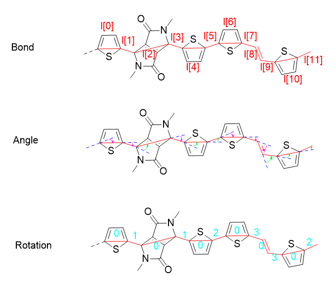

# Persistence Length of Semiflexible Conjugated Polymers using Transfer Matrix Method

## Introduction

This repository is an update of [Persistence Length Using Monte Carlo Sampling](https://github.com/Swordshinehjy/DFT_persistence_length_Monte_Carlo_sampling). The original method uses the Monte Carlo sampling. However, it seems that the persistence length in repeating units ($N_p$) is irrelevant to the bond lengths. Here, I re-implemented the method using the transfer matrix method.
## Transfer Matrix Method
Statistical Averaging of Dihedral Angles — Single-Step Average Rotation Operator
Dihedral angles are random (according to a known potential energy distribution), so for a given position i, we define the **single-step average rotation operator** as:

$$
A_i \equiv \langle Q_i(\phi)\rangle_{p_i} = \int_0^{2\pi} Q_i(\phi)p_i(\phi)d\phi,
$$

where $p\_i(\phi)=\dfrac{e^{-V\_i(\phi)/k_B T}}{Z_i}$, $Z_i=\int_0^{2\pi}e^{-V\_i(\phi)/k_B T} d\phi$.

Since $R\_y(\theta\_i)$ is independent of $\phi$, the above equation can be written as:

$$
A_i = \bigg(\int_0^{2\pi} R_z(\phi)p_i(\phi)d\phi\bigg)R_y(\theta_i) \equiv S_i R_y(\theta_i),
$$

and

$$
\int_0^{2\pi} R_z(\phi)p(\phi)\,d\phi =\begin{pmatrix}\langle\cos\phi\rangle & -\langle\sin\phi\rangle & 
0 \, \langle\sin\phi\rangle & \langle\cos\phi\rangle & 0 \, 
0 & 0 & 1\end{pmatrix},
$$

where

$$
\langle\cos\phi\rangle_i=\frac{\int_0^{2\pi}\cos\phi\,e^{-V_i(\phi)/k_BT} d\phi}{\int_0^{2\pi}e^{-V_i(\phi)/k_BT} d\phi},\quad\langle\sin\phi\rangle_i=\frac{\int_0^{2\pi}\sin\phi\,e^{-V_i(\phi)/k_BT} d\phi}{\int_0^{2\pi}e^{-V_i(\phi)/k_BT} d\phi}.
$$

Since each step is the action of a linear operator (with independent dihedral angles), the average transformation for n steps can be written as a product of operators:

$$
\langle t_n\rangle\= A_{n-1}A_{n-2}\cdots A_0 t_0.
$$

the autocorrelation is:

$$
C(n)=\langle t_n\cdot t_0\rangle 
=t_0^{T} \Big( \prod_{i=0}^{n-1} A_i \Big) t_0,
$$

where $\prod_{i=0}^{n-1} A_i \equiv A_{n-1}\cdots A_0$.

If the chain is **periodic** (a repeating unit has M segments, where $A_{i+M}=A_i$), we shall calculate **the transfer matrix for one repeating unit**:

$$
\mathcal{M}=\prod_{i=0}^{M-1} A_i,
$$

Then, the correlation for $r$ repeating units decays as $\mathcal{M}^r$. Let $\lambda_{\max}$ be the maximum eigenvalue (in modulus) of $\mathcal{M}$, then the persistence length in repeating units ($N_p$) is:

$$
N_p = -\frac{1}{\ln\lambda_{\max}}.
$$

## Definition of bond length and deflection angle in the script

*   T-bond-DPP-bond-T-bond-T-bond-E-bond-T-bond
*   l = [2.533, 1.432, 3.533, 1.432, 2.533, 1.432, 2.533, 1.433, 1.363, 1.433, 2.533, 1.432] # in Angstrom
*   2.533 is the bond length of Thiophene (l[0])
*   1.432 is the bond length of first linker (l[1])
*   Angle = np.deg2rad(np.array([-14.92, -10.83, 30.79, -30.79, 10.83, 14.92, -14.91, -13.29, -53.16, 53.16, 13.29, 14.91])) # convert degree to radian

*   l[1] rotated by Angle[1]
